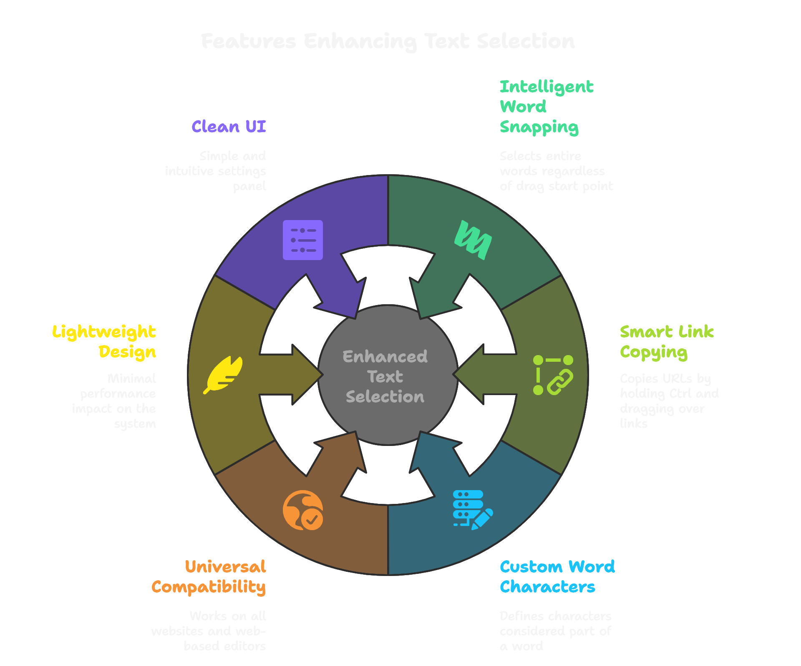

# Word Snap Selector — Chrome Extension  
**Developer:** Shubham Dhakal 

**Version:** 3.1 
---

**Word Snap Selector** is a Chrome extension that enhances text selection by automatically snapping to full words, eliminating the frustration of imprecise selections caused by touchpads or shaky mouse movements. It also includes a smart link copying feature: simply hold `Ctrl` and drag over any link to instantly copy its URL.  

---
### Features  
- **Intelligent Word Selection**: Snaps to whole words, even mid-drag, and handles punctuation across all websites.  
- **Smart Link Copying**: Hold `Ctrl` + drag on any link to copy its URL to clipboard, with visual highlighting.  
- **Customizable**: Use regex to define what counts as a word (default: `\w\-`), toggle the extension on/off, and preserve settings between sessions.  
---
### Installation  

**From Chrome Web Store**  
1. Visit the [Chrome Web Store](#)  
2. Click **Add to Chrome** and confirm  
---
**Manual Installation**  
1. Clone/download this repository  
2. Go to `chrome://extensions`  
3. Enable **Developer Mode** (top right)  
4. Click **Load unpacked** and select the extension folder  
---
### Usage  
- **Text Selection**: Click and drag as usual — the extension snaps selection to full words. Copy with `Ctrl+C`.  
- **Link Copying**: Hover over a link, hold `Ctrl`, then drag — the link URL is copied automatically.  
- **Settings**: Click the extension icon to toggle on/off or change the "Word Characters" regex (default: `\w\-`).  

### Technical Details  
- **Regex Word Characters**:  
  - `\w`: Letters (a–z, A–Z), digits (0–9), underscore `_`  
  - `\-`: Hyphen character  
  - Add others like `#@$.` if needed  
- **System Requirements**: Chrome v88+, works on Windows, macOS, and ChromeOS  
---
### Support  
Email: [shubhamdhakal01@gmail.com](mailto:support@wordsnapselector.com)  
---
### About the Developer  
**Shubham Dhakal** builds user-focused web tools and Chrome extensions.  
Connect:  [LinkedIn](https://www.linkedin.com/in/shubham-dhakal-b4bb21279)  

